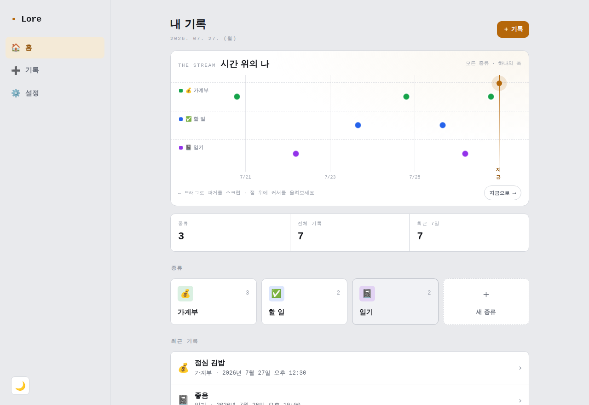
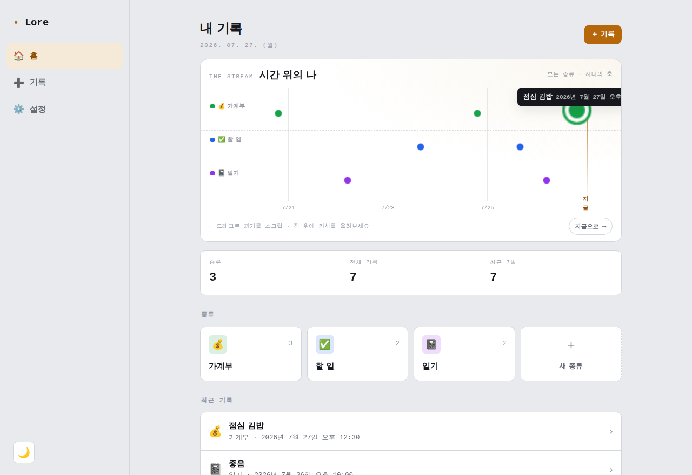
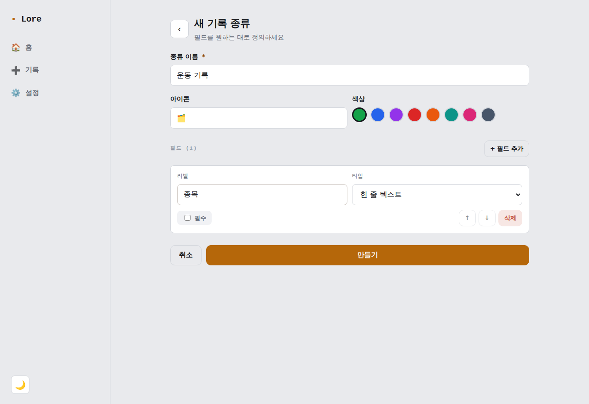
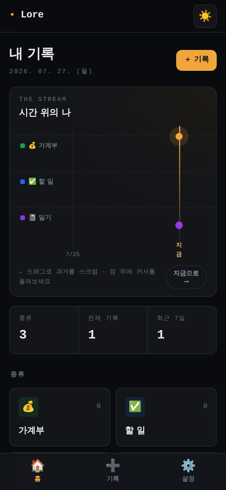
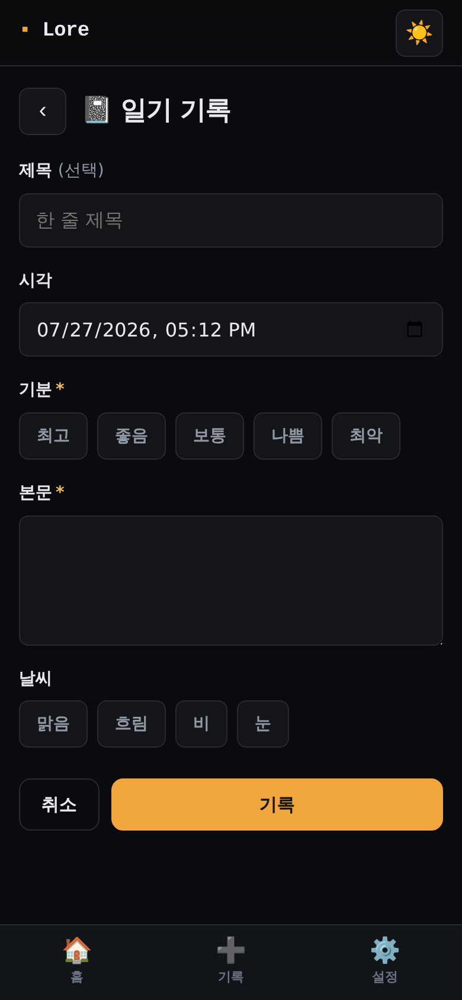
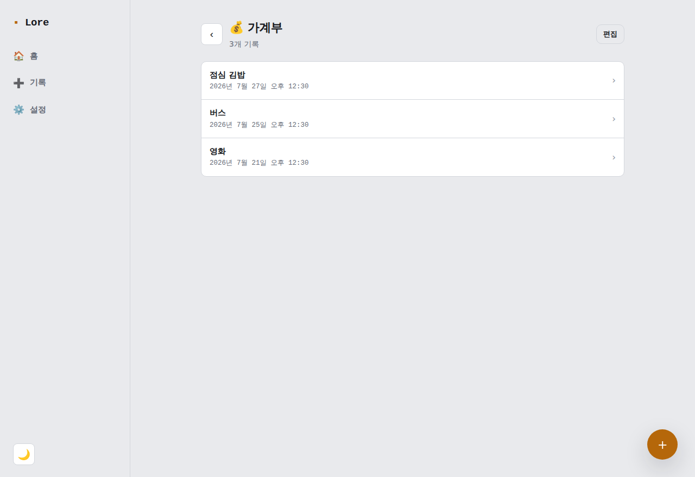

# Lore

> 내가 직접 정의하고, 내 기기에 살아있고, 오프라인에서도 즉시 동작하며 기기 간 동기화되는 **나만의 개인 기록 플랫폼.**
> PC 웹과 모바일 **네이티브 앱**에서 모두, Toss·배민 수준의 사용성으로.

가계부 · 일기 · 할 일 · 일정 · 커리어 · 이력서 — 겉보기엔 다른 기능이지만, 전부 *"특정 시점에, 내가, 태그를 붙여 남기고, 나중에 검색·집계하는 데이터"* 라는 하나의 뿌리를 공유합니다. Lore는 이 공통 뿌리를 **사용자가 직접 정의하는 스키마**로 추상화하고, **local-first** 아키텍처로 온전히 내 것으로 만들며, **유니버설 코드베이스**로 웹·모바일을 아우릅니다.

---

## 이 프로젝트가 존재하는 이유

- 기존 도구들은 파편화돼 있고(앱마다 따로), **내 데이터가 내 것이 아니며**(클라우드 종속), **내 입맛대로 구조를 바꿀 수 없다**.
- Lore는 이 세 가지를 정면으로 해결한다: **하나의 시스템 · 데이터 소유 · 무한한 커스터마이즈.**

자세한 배경은 [`docs/discovery.md`](./docs/discovery.md)(엔게이지먼트 브리프)와 [`docs/vision.md`](./docs/vision.md)를 참고.

## 두 개의 기술적 논지 (이 프로젝트의 척추)

1. **사용자 정의 스키마** — 도메인을 하드코딩하지 않는다. "기록 종류"를 사용자가 데이터로 정의한다.
2. **Local-first / 오프라인 우선** — 데이터는 내 기기에 있고, 오프라인에서도 즉시 동작하며, 기기 간 동기화된다.

두 논지는 서로 충돌하지만, **"동적 스키마를 코드가 아니라 데이터로 눕혀 물리 스키마를 고정한다"** 는 판단으로 해소한다([ADR-0001](./docs/adr/0001-core-theses-and-dynamic-schema-as-data.md)).

그리고 이 위에 **1급 제품 요구**가 하나 더 있다: **멀티플랫폼 · 네이티브급 UX.** local-first가 즉시성을 가능케 하고, 유니버설 전략([ADR-0005](./docs/adr/0005-client-multiplatform-strategy.md))과 [UX 원칙](./docs/ux-principles.md)이 그것을 웹·모바일 경험으로 실현한다.

## 기술 스택

| 영역 | 선택 | 근거 |
|---|---|---|
| 플랫폼 | 웹(PC) + iOS/Android **네이티브 앱** | [ADR-0005](./docs/adr/0005-client-multiplatform-strategy.md) |
| 클라이언트 | **유니버설**: Next.js(웹) + Expo/RN(모바일) + Tamagui + Solito | [ADR-0005](./docs/adr/0005-client-multiplatform-strategy.md) |
| 서버 | Next.js (App Router) Route Handlers | 웹 UI와 백엔드 통합 |
| ORM | Drizzle | [ADR-0002](./docs/adr/0002-orm-drizzle.md) |
| 동기화 엔진 | Phase 1 스파이크 후 결정 (웹+RN 지원 필수) | [ADR-0003](./docs/adr/0003-sync-engine-spike.md) |
| 구조 | Turborepo 모노레포 | [ADR-0004](./docs/adr/0004-monorepo-turborepo.md) |
| 검증 | Zod (필드정의 → 런타임 검증기) | [ADR-0001](./docs/adr/0001-core-theses-and-dynamic-schema-as-data.md) |
| UI | Tamagui 유니버설 컴포넌트·디자인 토큰 + 동적 폼 렌더러 | [ux-principles](./docs/ux-principles.md) |
| 서버 DB | PostgreSQL (동기화 원천) | — |
| 로컬 스토어 | 웹 SQLite-WASM/OPFS · 모바일 expo-sqlite | — |
| 인프라 | Docker · GitHub Actions · Vercel · Neon · EAS(모바일 빌드) | — |

## 문서 지도

| 문서 | 내용 |
|---|---|
| [`docs/discovery.md`](./docs/discovery.md) | 엔게이지먼트 브리프 — 실제 문제·니즈·제약·성공 기준 (FDE discovery) |
| [`docs/vision.md`](./docs/vision.md) | 제품 비전 · 두 논지 · 스코프 · 원칙 |
| [`docs/architecture.md`](./docs/architecture.md) | 유니버설 구조 · 물리 스키마 · schema-core · 데이터 흐름 |
| [`docs/ux-principles.md`](./docs/ux-principles.md) | UX 원칙과 측정 기준 (네이티브급 경험의 게이트) |
| [`docs/roadmap.md`](./docs/roadmap.md) | Phase 0–5 로드맵과 각 단계의 "증명" |
| [`docs/development.md`](./docs/development.md) | 로컬 개발/실행 가이드 (설치·명령·현재 동작 범위) |
| [`docs/adr/`](./docs/adr/) | 아키텍처 결정 기록 0001–0005 (What / Why / How / Trade-off / 반사실) |

## 현재 상태 — **동작하는 웹 MVP** ✅

문서·설계에 더해, **실제로 돌아가는 local-first 웹 앱**이 있다 (`apps/web`, `next build` 통과, Playwright 스모크 10/10):

- **사용자 정의 스키마(논지 A) — 라이브 증명.** UI에서 "기록 종류"와 필드를 정의하면 즉시 폼·검증·목록이 생성된다. Playwright가 코드 배포 없이 커스텀 종류를 만들어 확인.
- **Local-first(논지 B).** 데이터는 IndexedDB(내 기기)에 먼저 저장 → 오프라인·즉시성. JSON export/import로 소유·백업.
- **프리셋:** 가계부 · 할 일 · 일기 (하드코딩이 아니라 미리 정의된 "기록 종류").
- **UX:** 반응형(모바일 하단 내비 / 데스크톱 사이드바) · 라이트/다크 · ₩ 통화 포맷 · 세그먼트 입력.
- **풀스택:** `schema-core`(FieldDef→Zod, 테스트) · `db`(Drizzle 물리 스키마 + 마이그레이션 SQL) · `/api/sync`(push/pull+LWW).

검증된 것과 코드/설계만 된 것의 경계는 [`docs/mvp-buildlog.md`](./docs/mvp-buildlog.md), 실행법은 [`docs/development.md`](./docs/development.md).
독립 레포 분리는 [`docs/standalone.md`](./docs/standalone.md). 다음은 동기화 엔진 스파이크([ADR-0003](./docs/adr/0003-sync-engine-spike.md)) · Expo 네이티브 앱.

## 미리보기

홈의 시그니처 인터랙션 **The Stream** — 모든 기록 종류가 하나의 시간축을 공유한다는 이 프로젝트의 핵심 통찰을, 관성 스크러빙·포인터 자기장·"지금" 펄스가 있는 손수 만든 시각화로 보여준다([ADR-0008](./docs/adr/0008-visual-identity-and-home-signature-interaction.md)).

| 홈 · The Stream | 포인터 자기장 + 툴팁 | 필드 빌더 (스키마 정의) |
|---|---|---|
|  |  |  |

| 모바일 · 다크 | 모바일 입력 (다크) | 종류별 기록 |
|---|---|---|
|  |  |  |

> 정체성은 **그래파이트 + 앰버(琥珀) + 모노스페이스** — "내 삶의 로그(instrument)". 흔한 SaaS/AI 룩(둥근 카드·액센트 바·인디고)을 의도적으로 피했다. 위 화면은 전부 실제 빌드를 Playwright로 구동해 캡처했다(스모크 전부 통과).

---

## 이 저장소를 읽는 법 (케이스 스터디로서)

Lore는 "기능을 나열한 토이 프로젝트"가 아니라 **하나의 엔지니어링 케이스 스터디**다. 추천 순서:

1. `docs/discovery.md` — 어떤 실제 문제에서 출발했나 (What)
2. `docs/adr/0001`, `docs/adr/0005` — 왜 이 어려운 설계·플랫폼 전략을 택했나 (Why)
3. `docs/architecture.md` · `docs/ux-principles.md` — 어떻게 풀었나 (How)
4. `docs/roadmap.md` — 어떤 순서로 증명하나
