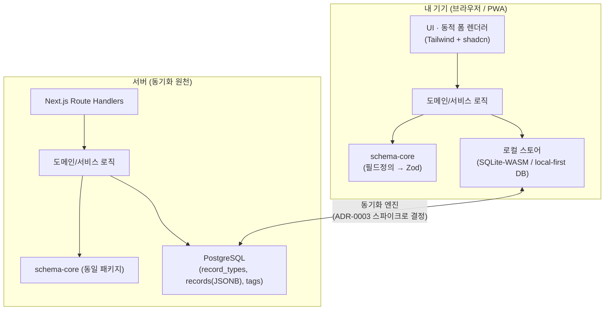

# Architecture — 아키텍처 개요

> 이 문서는 두 논지(사용자 정의 스키마 · local-first)를 **어떻게(How)** 구현하는지를 설명한다.
> 결정의 *근거(Why)* 는 각 ADR에, *배경(What)* 은 discovery/vision에 있다.

## 1. 큰 그림



핵심: **`schema-core`는 클라이언트와 서버가 동일하게 소비**한다. 그래서 검증·타입 로직이 양쪽에서 갈라지지 않는다 → 모노레포의 존재 이유([ADR-0004](./adr/0004-monorepo-turborepo.md)).

## 2. 물리 스키마 (고정 · 소수)

동적 스키마를 데이터로 눕히므로, 실제 테이블은 몇 개뿐이다. (개념 스케치 — 확정은 Phase 0 스키마 작업에서)

```
record_types            -- 사용자가 정의하는 "기록 종류"
  id            uuid
  owner_id      uuid
  name          text            -- 예: "가계부", "일기"
  fields        jsonb           -- FieldDef[] (아래 참고)
  icon, color   ...
  created_at, updated_at

records                 -- 실제 기록. 어떤 종류든 여기 저장
  id            uuid
  owner_id      uuid
  type_id       uuid  -> record_types.id
  occurred_at   timestamptz     -- "언제의 기록인가" (공통 축)
  title         text
  data          jsonb           -- 종류별 동적 필드 값
  created_at, updated_at, deleted_at (soft delete, 동기화 친화)

tags / record_tags      -- 도메인 공통 태깅
```

**FieldDef (개념):**
```ts
type FieldDef = {
  key: string;
  label: string;
  type: 'text' | 'number' | 'money' | 'date' | 'select' | 'boolean' | 'markdown' | ...;
  required?: boolean;
  options?: string[];   // select
  // ...
};
```

- **핫 필드 최적화:** 자주 필터/정렬하는 필드는 JSONB 위에 **생성 컬럼(generated column) + 인덱스**로 승격한다. 성능은 조기 벤치마크로 검증(리스크 항목).
- **동기화 친화:** 하드 삭제 대신 `deleted_at` soft delete, 그리고 `updated_at`/버전으로 충돌 해결의 기반을 만든다(구체 전략은 ADR-0003 스파이크에서).

## 3. schema-core (프로젝트의 두뇌)

- `record_types.fields`(FieldDef[]) → **Zod 스키마로 컴파일** → 기록 생성/수정 시 런타임 검증.
- 같은 FieldDef → **동적 폼 렌더러**가 입력 UI를 생성.
- 같은 FieldDef → 목록/상세 **뷰 렌더러**가 표시를 생성.
- 클라·서버 공유 패키지(`packages/schema-core`)라 검증 규칙이 단일 소스.

## 4. 레이어드 설계 (백엔드 깊이의 증거)

```
UI (app/, components/)         -- 얇게. 서비스 호출만.
  └─ Service (도메인 유스케이스, 검증·정책)
       └─ Repository (데이터 접근; 로컬 스토어 / Drizzle)
            └─ Store (local-first DB  ↔  Postgres)
```

Next.js 풀스택이지만 라우트 핸들러를 얇게 유지하고 서비스/레포지토리를 분리해, "Next에 다 때려박은 앱"이 아니라 **경계가 명확한 모듈러 모놀리스**로 만든다.

## 5. 모노레포 구조 (계획)

```
lore/
  apps/
    web/                 -- Next.js (App Router)
  packages/
    schema-core/         -- FieldDef ↔ Zod, 공유 타입 (클라+서버)
    db/                  -- Drizzle 스키마·쿼리
    ui/                  -- shadcn 기반 디자인 시스템 + 동적 폼 렌더러
  docs/                  -- discovery, vision, architecture, roadmap, adr
```

## 6. 열린 결정 (아직 확정 아님)

- **동기화 엔진** — ElectricSQL / Zero / RxDB / PowerSync 중 스파이크로 결정 (ADR-0003).
- **로컬 스토어 형태** — SQLite-WASM vs 엔진 내장 스토어. 동기화 엔진 선택에 종속.
- **충돌 해결 모델** — CRDT vs Last-Write-Wins. 데이터 특성(대부분 단일 사용자·단일 편집)상 LWW로 충분할 가능성, 스파이크에서 검증.
