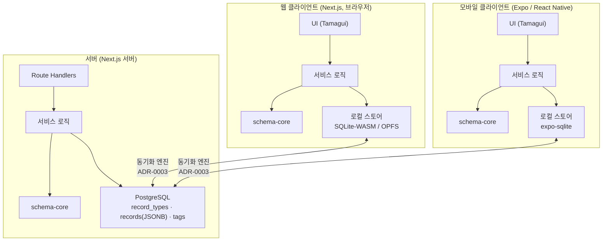

# Architecture — 아키텍처 개요

> 이 문서는 세 논지/요구(사용자 정의 스키마 · local-first · **멀티플랫폼 네이티브 UX**)를 **어떻게(How)** 구현하는지를 설명한다.
> 결정의 *근거(Why)* 는 각 ADR에, *배경(What)* 은 discovery/vision에 있다.

## 1. 큰 그림 (유니버설: 웹 + 모바일 + 서버)



- **`schema-core`(FieldDef↔Zod)와 `ui`(Tamagui)는 웹·모바일·서버가 공유** → 검증·타입·컴포넌트가 갈라지지 않는다(모노레포의 존재 이유, [ADR-0004](./adr/0004-monorepo-turborepo.md)).
- **동기화 엔진은 웹(SQLite-WASM)과 네이티브(expo-sqlite) 양쪽을 지원**해야 한다 → [ADR-0003](./adr/0003-sync-engine-spike.md)의 필수 관문.
- 클라이언트 UI가 웹·모바일 둘로 늘어도 **물리 스키마는 그대로 고정**(ADR-0001) — 동기화가 트랙터블한 이유.

## 2. 유니버설 UI 전략 ([ADR-0005](./adr/0005-client-multiplatform-strategy.md))

- **Tamagui** 유니버설 컴포넌트 → 웹 DOM + 네이티브 프리미티브로 동시 렌더. 디자인 토큰(색·타이포·스페이싱·모션)으로 라이트/다크·일관성.
- **Solito** → Next.js와 Expo의 내비게이션을 공유.
- **유니버설 기본, 플랫폼별 탈출구.** 데이터 밀도 높은 데스크톱 대시보드 등은 web 전용 레이아웃 허용.
- UX 규칙은 [ux-principles.md](./ux-principles.md)를 각 화면의 게이트로 사용.

## 3. 물리 스키마 (고정 · 소수)

동적 스키마를 데이터로 눕히므로 실제 테이블은 몇 개뿐이다. (개념 스케치 — 확정은 Phase 0 스키마 작업에서)

```
record_types            -- 사용자가 정의하는 "기록 종류"
  id            uuid
  owner_id      uuid
  name          text            -- 예: "가계부", "일기"
  fields        jsonb           -- FieldDef[] (아래 참고)
  icon, color   ...
  created_at, updated_at

records                 -- 실제 기록. 어떤 종류든 여기 저장
  id            uuid
  owner_id      uuid
  type_id       uuid  -> record_types.id
  occurred_at   timestamptz     -- "언제의 기록인가" (공통 축)
  title         text
  data          jsonb           -- 종류별 동적 필드 값
  created_at, updated_at, deleted_at (soft delete, 동기화 친화)

tags / record_tags      -- 도메인 공통 태깅
```

**FieldDef (개념):**
```ts
type FieldDef = {
  key: string;
  label: string;
  type: 'text' | 'number' | 'money' | 'date' | 'select' | 'boolean' | 'markdown' | ...;
  required?: boolean;
  options?: string[];   // select
  // ...
};
```

- **핫 필드 최적화:** 자주 필터/정렬하는 필드는 JSONB 위에 **생성 컬럼(generated column) + 인덱스**로 승격. 성능은 조기 벤치마크로 검증.
- **동기화 친화:** 하드 삭제 대신 `deleted_at` soft delete, `updated_at`/버전으로 충돌 해결의 기반 마련.

## 4. schema-core (프로젝트의 두뇌)

- `record_types.fields`(FieldDef[]) → **Zod 스키마로 컴파일** → 기록 생성/수정 시 런타임 검증.
- 같은 FieldDef → **동적 폼 렌더러**가 입력 UI 생성(Tamagui, 웹+네이티브).
- 같은 FieldDef → 목록/상세 **뷰 렌더러**가 표시 생성.
- **웹·모바일·서버 3자 공유** 패키지(`packages/schema-core`)라 검증 규칙이 단일 소스.

## 5. 로컬 스토어 (플랫폼별) & 동기화

| 위치 | 스토어 | 역할 |
|---|---|---|
| 웹 클라이언트 | SQLite-WASM / OPFS (또는 엔진 내장 스토어) | 오프라인 1차 사본 |
| 모바일 클라이언트 | expo-sqlite | 오프라인 1차 사본 |
| 서버 | PostgreSQL | 동기화 원천(진실의 유일 출처 아님) |

- 동기화 엔진 선택은 [ADR-0003](./adr/0003-sync-engine-spike.md) 스파이크로 결정하되, **웹+RN 양쪽 지원이 필수 관문**.
- 충돌 해결은 데이터 특성(대체로 단일 사용자·단일 편집)상 LWW로 충분할 가능성 — 스파이크에서 검증.

## 6. 레이어드 설계 (백엔드 깊이의 증거)

```
UI (Tamagui, apps/web · apps/mobile)   -- 얇게. 서비스 호출만.
  └─ Service (도메인 유스케이스, 검증·정책)
       └─ Repository (데이터 접근; 로컬 스토어 / Drizzle)
            └─ Store (local-first DB  ↔  Postgres)
```

Next.js 풀스택이지만 라우트 핸들러를 얇게 유지하고 서비스/레포지토리를 분리해 **경계가 명확한 모듈러 모놀리스**로 만든다.

## 7. 모노레포 구조 (Phase 0에서 실제 구현됨)

```
lore/
  apps/
    web/                 -- Next.js (App Router): 웹 UI + 서버(API·Drizzle/Postgres)  [셸]
    mobile/              -- Expo (React Native): 네이티브 앱                          [셸]
  packages/
    schema-core/         -- FieldDef ↔ Zod, 공유 타입 (웹+모바일+서버)  [실구현·테스트됨]
    db/                  -- Drizzle 스키마·쿼리 (서버)                   [실구현]
    ui/                  -- Tamagui 유니버설 컴포넌트·디자인 토큰         [Phase 2–3]
  docs/                  -- discovery, vision, architecture, roadmap, ux-principles, development, adr
  turbo.json · pnpm-workspace.yaml · docker-compose.yml · .github/workflows/ci.yml
```

- **`schema-core`·`db`는 실제 코드**(논지 A의 구현). `apps/*`와 `ui`는 위상을 세우는 셸이며, 각 앱은 `schema-core`를 실제로 import 해 "같은 코드가 웹·네이티브에서 동작"함을 스모크로 보인다.
- 실행/설치는 [development.md](./development.md).

## 8. 열린 결정 (아직 확정 아님)

- **동기화 엔진** — 웹+RN 지원을 필수 관문으로, ElectricSQL / PowerSync / RxDB / (Zero) 중 스파이크로 결정 ([ADR-0003](./adr/0003-sync-engine-spike.md)).
- **로컬 스토어 형태** — 웹의 SQLite-WASM vs 엔진 내장 스토어. 동기화 엔진 선택에 종속.
- **충돌 해결 모델** — CRDT vs Last-Write-Wins. 스파이크에서 검증.
